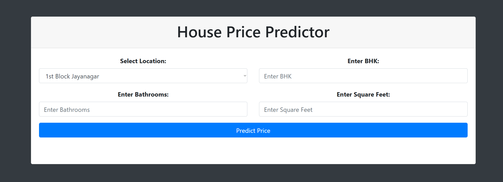
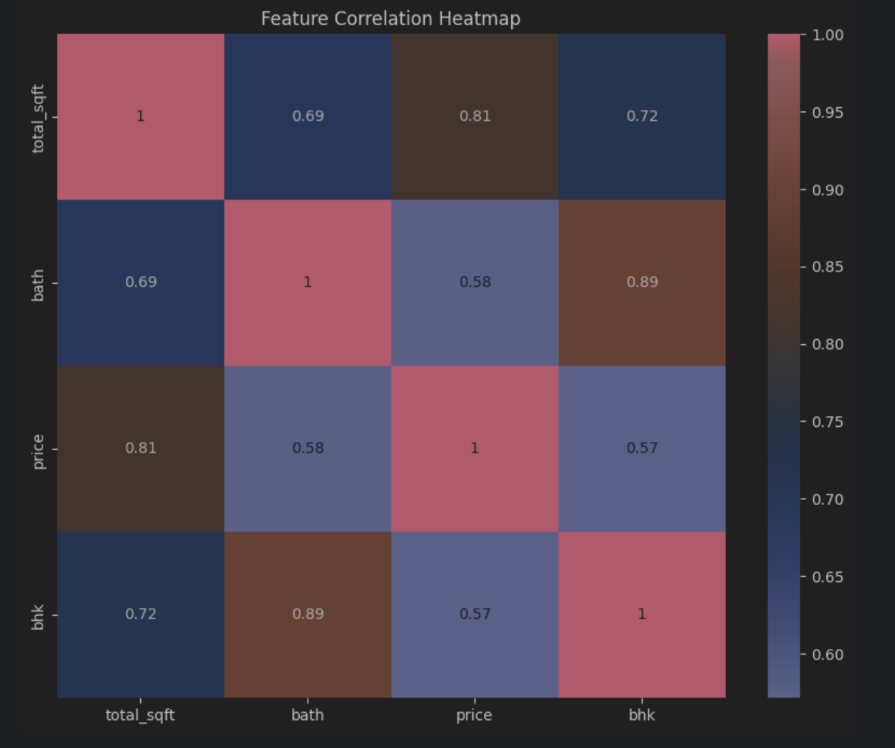

# Bengaluru House Price Prediction

## Overview
This project predicts house prices in Bengaluru using Machine Learning and deploys the model through a Flask web application.

---

## Features
- Predict house price based on:
  - Location
  - BHK
  - Bathrooms
  - Total Square Feet
- Price displayed in Lakhs and Crores
- Interactive Web Interface

---

## Tech Stack
- Python
- Pandas
- NumPy
- Scikit-learn
- Flask
- HTML / CSS

---

## Machine Learning Workflow
1. Data Cleaning
2. Feature Engineering
3. Model Training (Ridge Regression)
4. Model Evaluation
5. Model Deployment

---

## Model Performance
- R² Score: 0.86
- RMSE: 34.06

---

## Application Interface


## Prediction Result


## EDA Heatmap


---

## Run Locally

```bash
pip install -r requirements.txt
python app.py