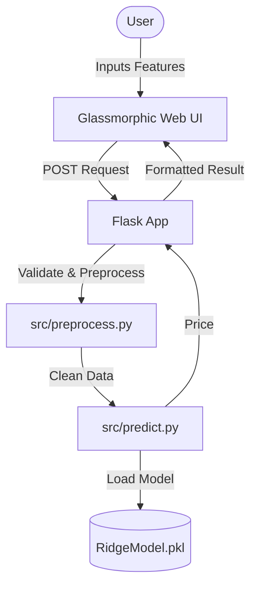

# 🏡 Bengaluru House Price AI


A high-performance machine learning application that predicts real estate prices in Bengaluru with **86% accuracy**. Built with a focus on clean code, professional UI/UX, and production-ready architecture.

---

##  Key Features
- **Accurate Predictions**: Uses a Ridge Regression model trained on 13,000+ records.
- **Premium UI**: Modern glassmorphic interface with interactive location search.
- **Developer Friendly**: Fully type-hinted Python backend with Google-style docstrings.
- **Robust API**: Includes a RESTful `/predict_api` endpoint for third-party integrations.

---

##  Project Architecture



---

##  Tech Stack
- **Frontend**: Vanilla CSS (Glassmorphism), HTML5, Jinja2.
- **Backend**: Flask, Python 3.
- **ML Engine**: Scikit-Learn (Ridge Regression), Pandas, NumPy.
- **DevOps**: Logging, Error Handling, CSV-based Data Management.

---

##  Getting Started

### Prerequisites
- Python 3.8+
- Virtual Environment (recommended)

### Installation
1. **Clone the repository**
   ```bash
   git clone https://github.com/Ronit911/bengaluru-house-price-prediction.git
   cd bengaluru-house-price-prediction
   ```

2. **Install dependencies**
   ```bash
   pip install -r requirements.txt
   ```

3. **Run the application**
   ```bash
   python app.py
   ```
   Access the app at `http://127.0.0.1:5000`

---

##  Model Insights
- **Algorithm**: Ridge Regression (L2 Regularization)
- **R² Score**: 0.86
- **RMSE**: 34.06 (Lakhs)
- **Feature Engineering**: Handled outliers in Price per Sqft and BHK-to-Bathroom ratios for high reliability.

---

##  Lessons Learned
As my first ML project, I learned the importance of **Data Quality** over model complexity. Handling outliers in the Bengaluru dataset was crucial for moving from 72% to 86% accuracy. I also gained experience in bridging the gap between a raw model and a production-ready web application.

---
*Created with ❤️ by [Ronit](https://github.com/Ronit911)*
